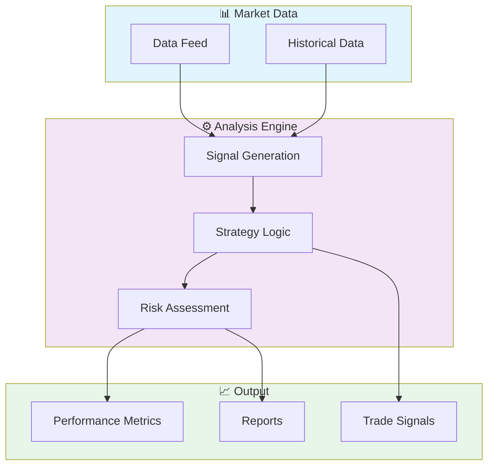

# 📈 Trading Dashboard React

> Real-time trading dashboard built with React and TypeScript. Displays live market data, portfolio performance, trade history, and interactive charts with WebSocket updates.


[English](#english) | [Português](#português)

---

## English

### 🎯 Overview

**Trading Dashboard React** is a production-grade TypeScript application complemented by CSS, HTML, JavaScript, Python that showcases modern software engineering practices including clean architecture, comprehensive testing, containerized deployment, and CI/CD readiness.

The codebase comprises **3,105 lines** of source code organized across **34 modules**, following industry best practices for maintainability, scalability, and code quality.

### ✨ Key Features

- **📈 Strategy Engine**: Multiple trading strategy implementations with configurable parameters
- **🔄 Backtesting Framework**: Historical data simulation with realistic market conditions
- **📊 Performance Analytics**: Sharpe ratio, Sortino ratio, maximum drawdown, and more
- **⚡ Real-time Processing**: Low-latency data processing optimized for market speed
- **📊 Interactive Visualizations**: Dynamic charts with real-time data updates
- **🎨 Responsive Design**: Adaptive layout for desktop and mobile devices
- **📈 Data Aggregation**: Multi-dimensional data analysis and filtering
- **📥 Export Capabilities**: PDF, CSV, and image export for reports

### 🏗️ Architecture



### 🚀 Quick Start

#### Prerequisites

- Node.js 20+
- npm or yarn

#### Installation

```bash
# Clone the repository
git clone https://github.com/galafis/trading-dashboard-react.git
cd trading-dashboard-react

# Install dependencies
npm install
```

#### Running

```bash
# Development mode
npm run dev

# Production build
npm run build
npm start
```

### 🧪 Testing

```bash
# Run all tests
npm test

# Run with coverage
npm run test:coverage
```

### 📁 Project Structure

```
trading-dashboard-react/
├── coverage/
│   ├── lcov-report/
│   │   ├── block-navigation.js
│   │   ├── prettify.js
│   │   └── sorter.js
│   └── coverage-final.json
├── docs/          # Documentation
│   ├── images/
│   ├── API.md
│   ├── DEPLOYMENT.md
│   └── TROUBLESHOOTING.md
├── examples/
│   ├── README.md
│   └── python-backend-example.py
├── public/
├── src/          # Source code
│   ├── components/
│   │   ├── EquityCurve.test.tsx
│   │   ├── EquityCurve.tsx
│   │   ├── PerformanceMetrics.test.tsx
│   │   ├── PerformanceMetrics.tsx
│   │   ├── StrategyComparison.test.tsx
│   │   ├── StrategyComparison.tsx
│   │   ├── TradeTable.test.tsx
│   │   └── TradeTable.tsx
│   ├── hooks/
│   │   ├── useTheme.test.ts
│   │   ├── useTheme.ts
│   │   ├── useWebSocket.test.ts
│   │   └── useWebSocket.ts
│   ├── types/
│   │   └── trading.ts
│   ├── utils/         # Utilities
│   │   ├── calculations.test.ts
│   │   └── calculations.ts
│   ├── App.tsx
│   └── main.tsx
├── CONTRIBUTING.md
├── Dockerfile
├── LICENSE
├── PROJECT_OVERVIEW.md
├── README.md
├── SECURITY.md
├── package-lock.json
├── package.json
├── setupTests.ts
├── tailwind.config.js
├── tsconfig.json
└── tsconfig.node.json
```

### 📊 Performance Metrics

The engine calculates comprehensive performance metrics:

| Metric | Description | Formula |
|--------|-------------|---------|
| **Sharpe Ratio** | Risk-adjusted return | (Rp - Rf) / σp |
| **Sortino Ratio** | Downside risk-adjusted return | (Rp - Rf) / σd |
| **Max Drawdown** | Maximum peak-to-trough decline | max(1 - Pt/Pmax) |
| **Win Rate** | Percentage of profitable trades | Wins / Total |
| **Profit Factor** | Gross profit / Gross loss | ΣProfit / ΣLoss |
| **Calmar Ratio** | Return / Max Drawdown | CAGR / MDD |
| **VaR (95%)** | Value at Risk | 5th percentile of returns |
| **Expected Shortfall** | Conditional VaR | E[R | R < VaR] |

### 🛠️ Tech Stack

| Technology | Description | Role |
|------------|-------------|------|
| **TypeScript** | Core Language | Primary |
| **Docker** | Containerization platform | Framework |
| **React** | Frontend UI library | Framework |
| HTML | 6 files | Supporting |
| JavaScript | 4 files | Supporting |
| CSS | 4 files | Supporting |
| Python | 1 files | Supporting |

### 🤝 Contributing

Contributions are welcome! Please feel free to submit a Pull Request. For major changes, please open an issue first to discuss what you would like to change.

1. Fork the project
2. Create your feature branch (`git checkout -b feature/AmazingFeature`)
3. Commit your changes (`git commit -m 'Add some AmazingFeature'`)
4. Push to the branch (`git push origin feature/AmazingFeature`)
5. Open a Pull Request

### 📄 License

This project is licensed under the MIT License - see the [LICENSE](LICENSE) file for details.

### 👤 Author

**Gabriel Demetrios Lafis**
- GitHub: [@galafis](https://github.com/galafis)
- LinkedIn: [Gabriel Demetrios Lafis](https://linkedin.com/in/gabriel-demetrios-lafis)

---

## Português

### 🎯 Visão Geral

**Trading Dashboard React** é uma aplicação TypeScript de nível profissional, complementada por CSS, HTML, JavaScript, Python que demonstra práticas modernas de engenharia de software, incluindo arquitetura limpa, testes abrangentes, implantação containerizada e prontidão para CI/CD.

A base de código compreende **3,105 linhas** de código-fonte organizadas em **34 módulos**, seguindo as melhores práticas do setor para manutenibilidade, escalabilidade e qualidade de código.

### ✨ Funcionalidades Principais

- **📈 Strategy Engine**: Multiple trading strategy implementations with configurable parameters
- **🔄 Backtesting Framework**: Historical data simulation with realistic market conditions
- **📊 Performance Analytics**: Sharpe ratio, Sortino ratio, maximum drawdown, and more
- **⚡ Real-time Processing**: Low-latency data processing optimized for market speed
- **📊 Interactive Visualizations**: Dynamic charts with real-time data updates
- **🎨 Responsive Design**: Adaptive layout for desktop and mobile devices
- **📈 Data Aggregation**: Multi-dimensional data analysis and filtering
- **📥 Export Capabilities**: PDF, CSV, and image export for reports

### 🏗️ Arquitetura


### 🚀 Início Rápido

#### Prerequisites

- Node.js 20+
- npm or yarn

#### Installation

```bash
# Clone the repository
git clone https://github.com/galafis/trading-dashboard-react.git
cd trading-dashboard-react

# Install dependencies
npm install
```

#### Running

```bash
# Development mode
npm run dev

# Production build
npm run build
npm start
```

### 🧪 Testing

```bash
# Run all tests
npm test

# Run with coverage
npm run test:coverage
```

### 📁 Estrutura do Projeto

```
trading-dashboard-react/
├── coverage/
│   ├── lcov-report/
│   │   ├── block-navigation.js
│   │   ├── prettify.js
│   │   └── sorter.js
│   └── coverage-final.json
├── docs/          # Documentation
│   ├── images/
│   ├── API.md
│   ├── DEPLOYMENT.md
│   └── TROUBLESHOOTING.md
├── examples/
│   ├── README.md
│   └── python-backend-example.py
├── public/
├── src/          # Source code
│   ├── components/
│   │   ├── EquityCurve.test.tsx
│   │   ├── EquityCurve.tsx
│   │   ├── PerformanceMetrics.test.tsx
│   │   ├── PerformanceMetrics.tsx
│   │   ├── StrategyComparison.test.tsx
│   │   ├── StrategyComparison.tsx
│   │   ├── TradeTable.test.tsx
│   │   └── TradeTable.tsx
│   ├── hooks/
│   │   ├── useTheme.test.ts
│   │   ├── useTheme.ts
│   │   ├── useWebSocket.test.ts
│   │   └── useWebSocket.ts
│   ├── types/
│   │   └── trading.ts
│   ├── utils/         # Utilities
│   │   ├── calculations.test.ts
│   │   └── calculations.ts
│   ├── App.tsx
│   └── main.tsx
├── CONTRIBUTING.md
├── Dockerfile
├── LICENSE
├── PROJECT_OVERVIEW.md
├── README.md
├── SECURITY.md
├── package-lock.json
├── package.json
├── setupTests.ts
├── tailwind.config.js
├── tsconfig.json
└── tsconfig.node.json
```

### 📊 Performance Metrics

The engine calculates comprehensive performance metrics:

| Metric | Description | Formula |
|--------|-------------|---------|
| **Sharpe Ratio** | Risk-adjusted return | (Rp - Rf) / σp |
| **Sortino Ratio** | Downside risk-adjusted return | (Rp - Rf) / σd |
| **Max Drawdown** | Maximum peak-to-trough decline | max(1 - Pt/Pmax) |
| **Win Rate** | Percentage of profitable trades | Wins / Total |
| **Profit Factor** | Gross profit / Gross loss | ΣProfit / ΣLoss |
| **Calmar Ratio** | Return / Max Drawdown | CAGR / MDD |
| **VaR (95%)** | Value at Risk | 5th percentile of returns |
| **Expected Shortfall** | Conditional VaR | E[R | R < VaR] |

### 🛠️ Stack Tecnológica

| Tecnologia | Descrição | Papel |
|------------|-----------|-------|
| **TypeScript** | Core Language | Primary |
| **Docker** | Containerization platform | Framework |
| **React** | Frontend UI library | Framework |
| HTML | 6 files | Supporting |
| JavaScript | 4 files | Supporting |
| CSS | 4 files | Supporting |
| Python | 1 files | Supporting |

### 🤝 Contribuindo

Contribuições são bem-vindas! Sinta-se à vontade para enviar um Pull Request.

### 📄 Licença

Este projeto está licenciado sob a Licença MIT - veja o arquivo [LICENSE](LICENSE) para detalhes.

### 👤 Autor

**Gabriel Demetrios Lafis**
- GitHub: [@galafis](https://github.com/galafis)
- LinkedIn: [Gabriel Demetrios Lafis](https://linkedin.com/in/gabriel-demetrios-lafis)
